# 🌍 WanderAI - AI Trip Planner ✈️

WanderAI is an AI-powered trip planner built with **Next.js, React, TypeScript, Convex, Arcjet, Clerk Authentication, Google Gemini 1.5 Flash, Pixabay API, Unsplash API, and more**.  
It helps users effortlessly plan trips, explore destinations, and generate detailed itineraries.

---

## 🚀 Features
- 🤖 **AI-Powered Trip Planning** using **Google Gemini 1.5 Flash**
- 📸 **Automatic fetching of destination images** from Pixabay & Unsplash
- 🔐 **Secure authentication** with Clerk
- 🗄️ **Database & backend logic** powered by Convex
- ⚡ **Rate limiting & security** via Arcjet
- 🍁 ** Google Maps using Google Api
- 🎨 **Modern responsive UI** with TailwindCSS + ShadCN/UI
- 🎥 **Video backgrounds & animations** for immersive experience
- 🗺️ **Interactive maps** with MapLibre / Globe integration (optional you can add that also)

---

## 📂 Project Structure

```
WanderAI/
│── .next/                  # Next.js build folder
│── .vscode/                # VSCode settings
│── app/                    # Next.js App Router
│   ├── (auth)/             # Authentication pages
│   ├── api/                # API routes
│   ├── Components/         # Reusable components
│   ├── create-new-trip/    # Trip creation pages
│   ├── my-trips/           # User trips
│   ├── pricing/            # Pricing page
│   ├── view-trips/         # View trips page
│   ├── layout.tsx          # Root layout
│   ├── page.tsx            # Homepage
│   └── Provider.tsx        # Global provider
│
│── components/             # Shared components
│   ├── magicui/            # Custom magic UI effects
│   └── ui/                 # UI building blocks
│
│── convex/                 # Convex backend functions
│── hooks/                  # Custom React hooks
│── public/                 # Static assets (images, icons, media)
│   ├── S1.png … S12.png    # Screenshots
│   ├── logo.png            # App logo
│   ├── globe.svg           # Globe assets
│   └── ...                 # Other images & media
│
│── package.json            # Dependencies & scripts
│── next.config.ts          # Next.js config
│── middleware.ts           # Middleware
│── postcss.config.mjs      # Tailwind/PostCSS config
│── tsconfig.json           # TypeScript config
│── README.md               # Project documentation
```

---

## 🖼️ Screenshots

<h1 className='font-bold text-4xl'>Here Are Some Screenshots of My project WANDER-AI</h1>

<p align="center">
  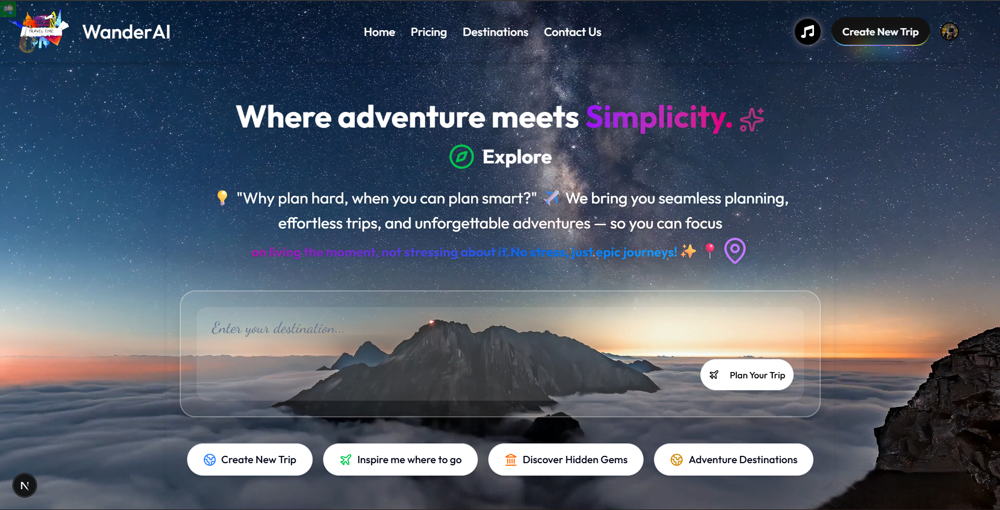
  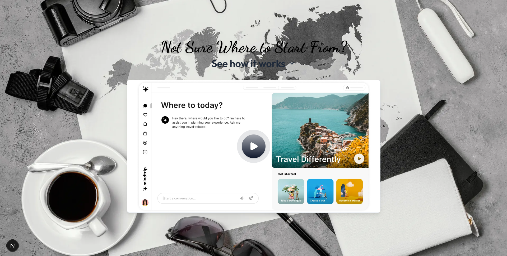
</p>

<p align="center">
  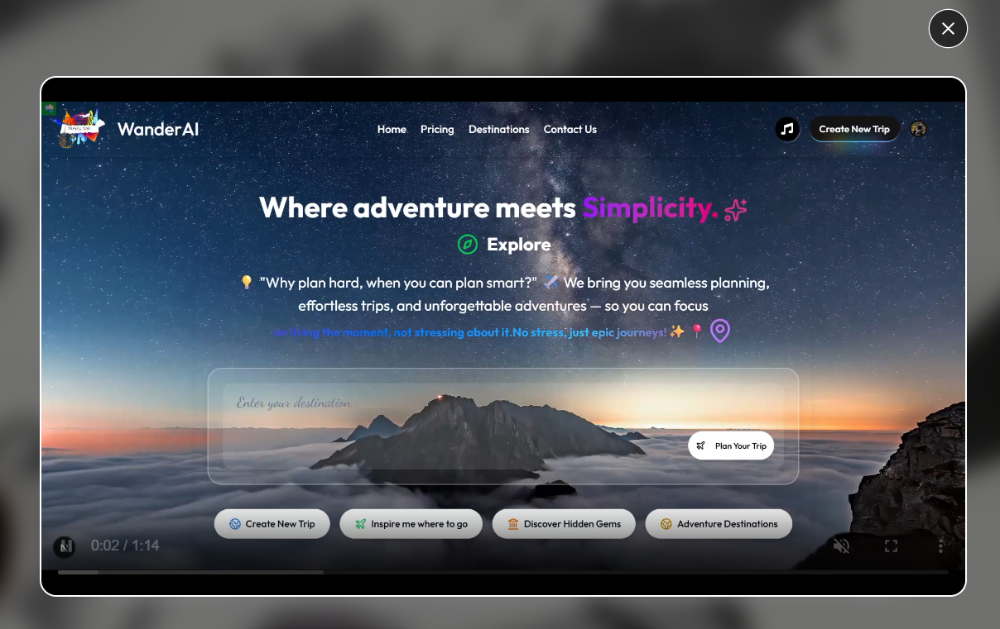
  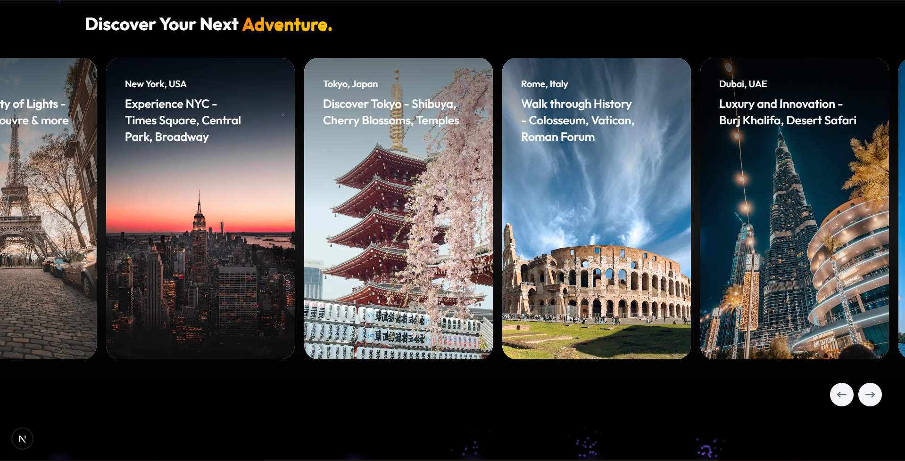
</p>

<p align="center">
  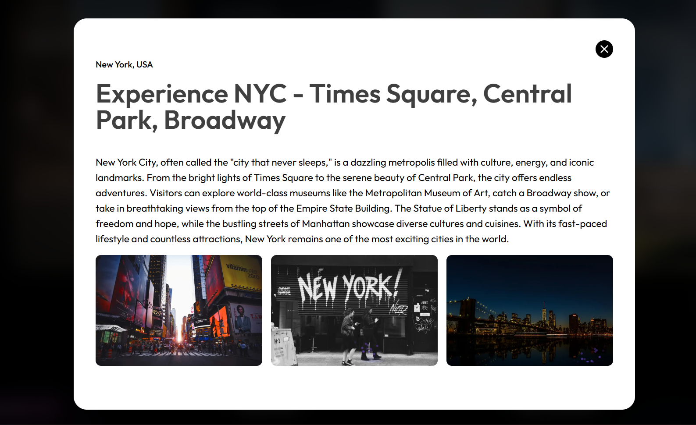
  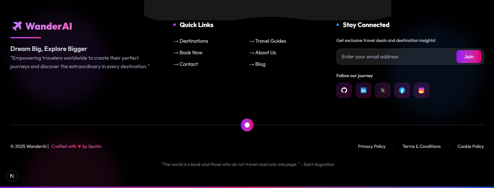
</p>

<p align="center">
  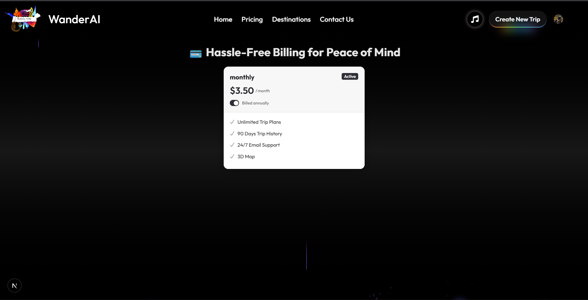
  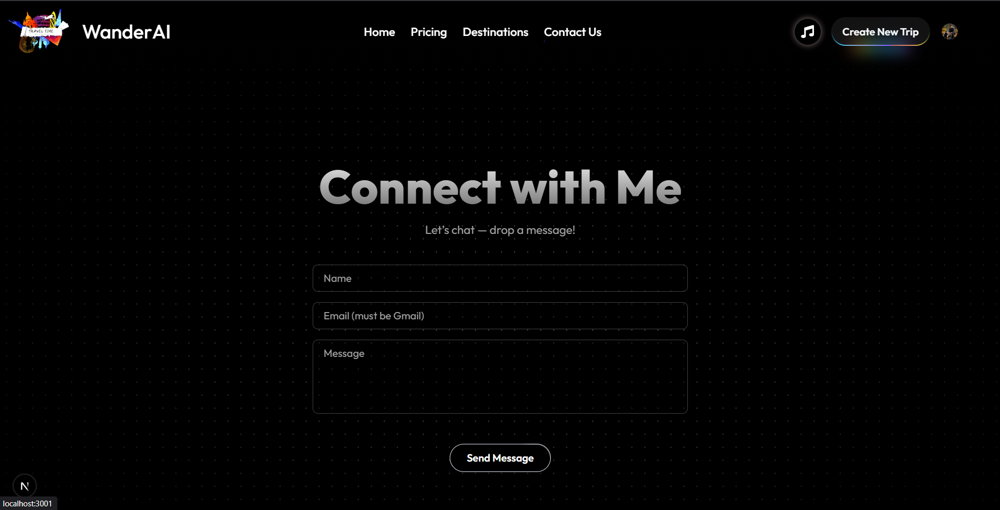
</p>

<p align="center">
  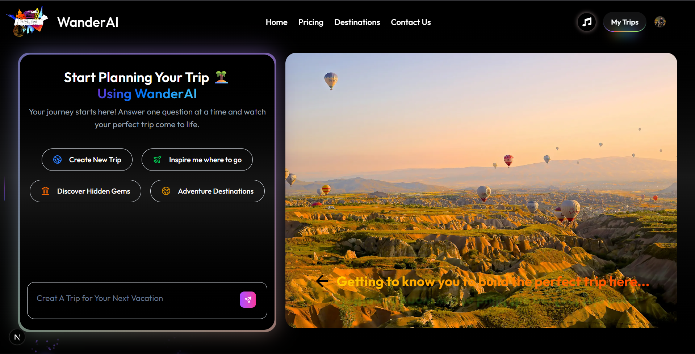
  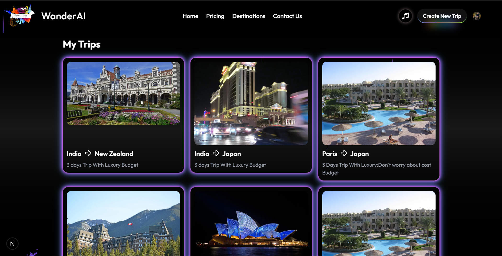
</p>

<p align="center">
  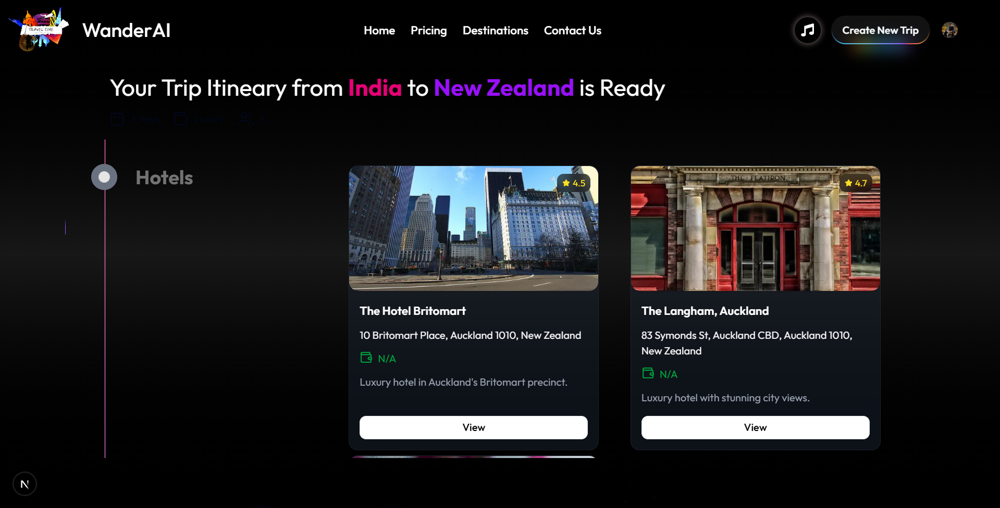
  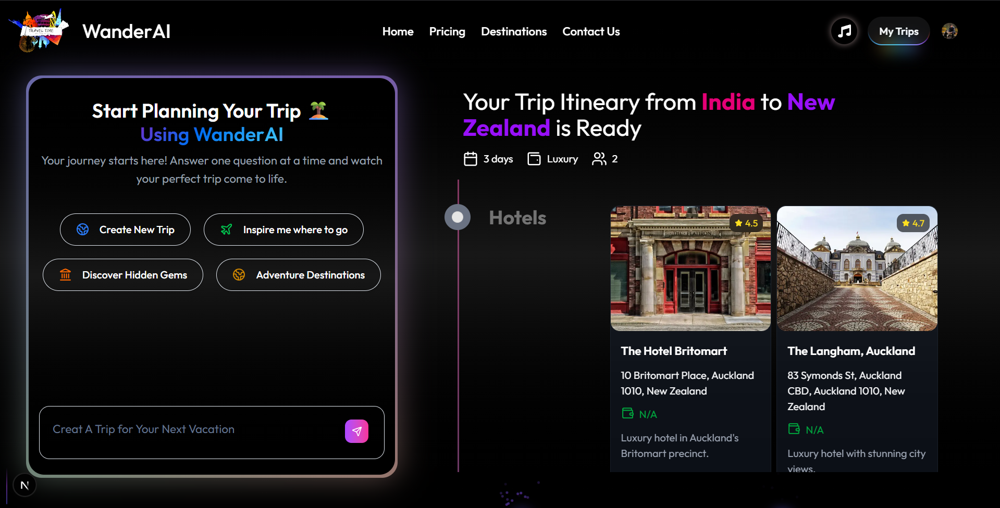
</p>


---

## ⚙️ Tech Stack

### 🖥️ Frontend
 
 
 
  

### ⚡ Backend & DB
  

### 🔐 Authentication & Security

  

### 🤖 AI
  

### 📸 APIs

  

### 🛠️ Tools
 
 
 
  

---

## 📦 Installation & Setup

Clone the repository and install dependencies:

```bash
git clone https://github.com/yourusername/wanderai.git
cd wanderai
npm install
```

Run the development server:

```bash
npm run dev
```

---

## 🙌 Acknowledgements

- [Next.js](https://nextjs.org/)  
- [Convex](https://convex.dev/)  
- [Clerk](https://clerk.com/)  
- [Arcjet](https://arcjet.com/)  
- [Pixabay](https://pixabay.com/)  
- [Unsplash](https://unsplash.com/)  
- [Google Gemini](https://ai.google/)  

---

## 📜 License

```
Copyright (c) 2025 Sachin Pundir  
All Rights Reserved.  

Unauthorized copying, modification, distribution, or use of this software, via any medium, is strictly prohibited.  
This software is proprietary and confidential.  

Developed by Sachin Pundir 🚀
```

---

💡 *Dream. Plan. Explore. With WanderAI!* 🌍✨
